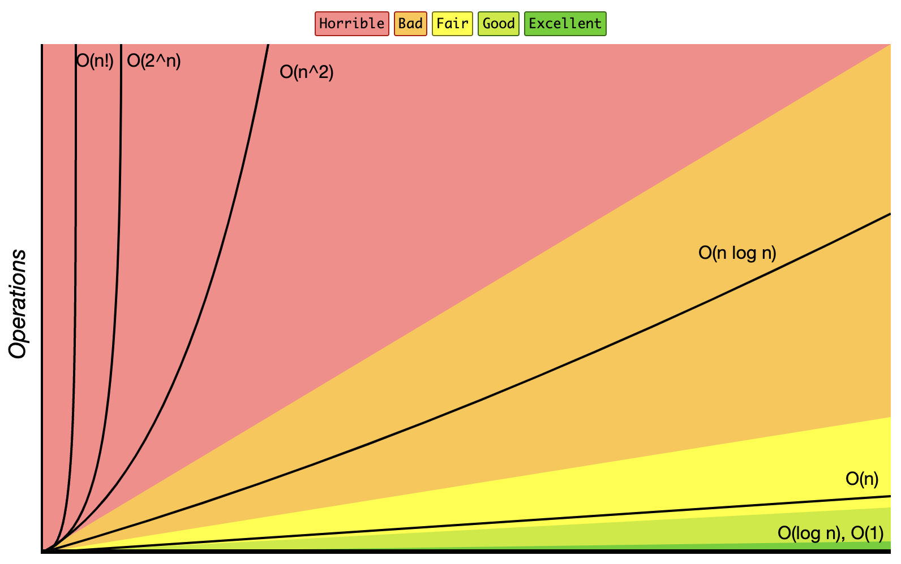
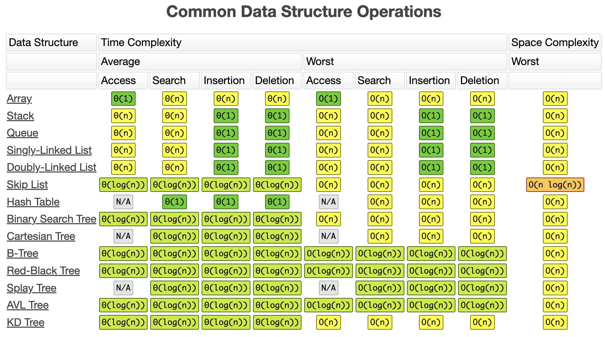
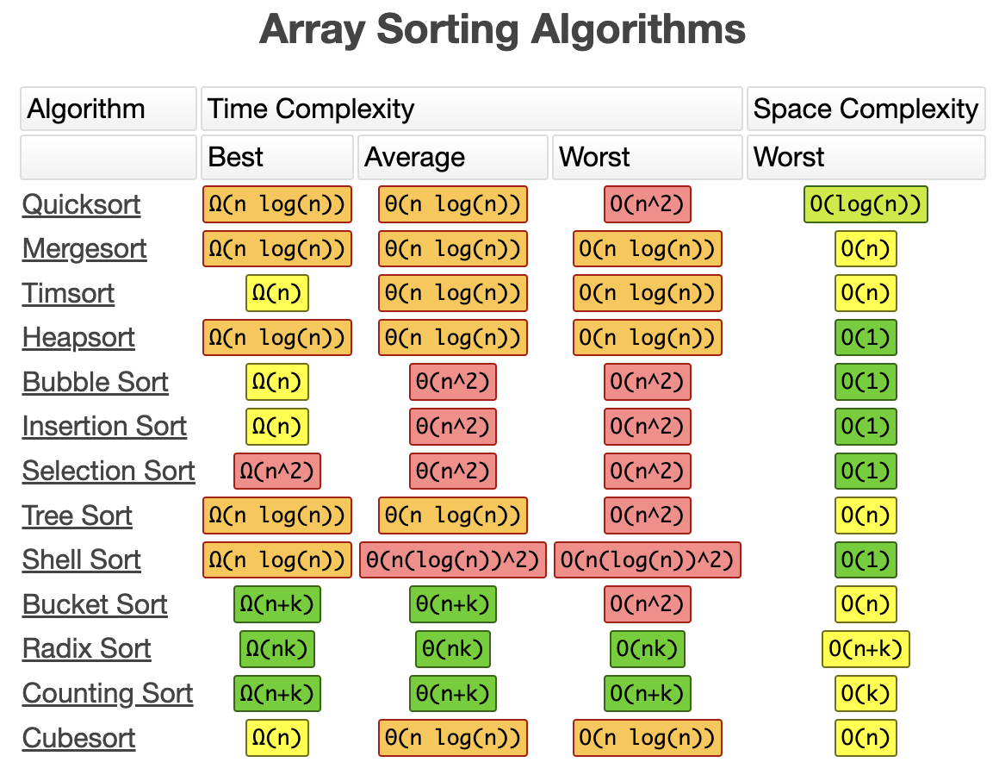

# Preparation

## Big O Notation

### Overview

- This topic explains the concept of big O for comparing code efficiency.
- Big O is used to analyze time and space complexity of code.
- Time complexity is measured by the number of operations, while space complexity considers memory usage.
- Understanding both time and space complexity is crucial for coding interviews.
- For the most part in this class we will be dealing with time complexity.



### Ω/Θ/O

- Three Greek letters used in time and space complexity: omega(Ω), theta(Θ), and Omicron(O).
- It distinguishes between best case (omega), average case (theta), and worst case (omicron) scenarios.
- Technically, big O always represents the worst case, despite common usage of average and best case scenarios.

### Drop Constant

- Why we drop constants while discussing big O?
	- Focus on Asymptotic Behavior: Big O notation is about how an algorithm scales with large inputs. Constants become insignificant when the input size is very large.
	- Simplification: Dropping constants makes Big O notation easier to work with and compare algorithms.
- Key Points:
	- Dropping constants doesn't mean they're unimportant in practice. They can affect performance for small input sizes.
	- Big O notation is a tool for understanding the **long-term behavior** of algorithms.

> **Example:**
> Let's say we have two algorithms:
> - Algorithm A: Runtime is `5n + 10`
> - Algorithm B: Runtime is `n^2`
> 
> Dropping Constants:
> - Algorithm A: O(n) (We drop the '5' and '10')
> - Algorithm B: O(n^2)
> 
> Algorithm B grows much faster than Algorithm A as the input size increases, even though Algorithm A has a larger constant factor initially.

### Drop Non-Dominants

- When analyzing the time complexity of an algorithm using Big O notation, we focus on the term that grows most quickly as the input size grows.
- So you can ignore lower-order terms and coefficients in the function and only consider the dominant term since it represents the most significant factor in determining the algorithm's efficiency.

> **Example:**
> we have a function that represents the time complexity of an algorithm:
> `f(n) = 3n^2 + 5n + 2`
> In this function, we have three terms: `3n^2`, `5n`, and `2`. To drop non-dominants and determine the Big O notation for this function, we focus on the dominant term, which is `3n^2` since it grows most quickly as n increases.
> After dropping the non-dominant terms and coefficients, the simplified expression would be:
> `O(n^2)`
> So, in this case, we would say that the time complexity of the algorithm represented by the function f(n) is `O(n^2)`, indicating that it has a quadratic time complexity.

### Different Terms for Inputs

- If there are different terms of inputs in an algorithm, you need to treat it separately while calculating the big O notation.

```cpp
// O(a + b)
void PrintItems(int a, int b)
{
	for (int i = 0; i < a; i++)
	{
		cout << i << endl;
	}
	for (int j = 0; j < b; j++)
	{
		cout << j << endl;
	}
}

// O(a * b)
void PrintItems(int a, int b)
{
	for (int i = 0; i < a; i++)
	{
		for (int j = 0; j < b; j++)
		{
			cout << i << j << endl;
		}
	}
}
```

### Wrap Up





## Class


```cpp
#include <iostream>

using namespace std;

class Cookie
{
    private:
        string color;

    public:
        Cookie (string color)
        {
            this->color = color;
        }
        string getColor ()
        {
            return color;
        }
        void setColor (string color)
        {
            this->color = color;
        }
};


int main()
{
    Cookie* cookieOne = new Cookie("green");
    Cookie* cookieTwo = new Cookie("blue");

    cookieOne->setColor("yellow"); 

    cout << "C1: " << cookieOne->getColor() << endl;
    cout << "C2: " << cookieTwo->getColor() << endl;
}

```

## Pointer

```cpp
#include <iostream>

using namespace std;

int main()
{
	int* num1 = new int(15);
	int* num2 = num1;
    
    cout << "num1 = " << num1 << endl;
    cout << "num2 = " << num2 << endl;
    return 0;
}

```
